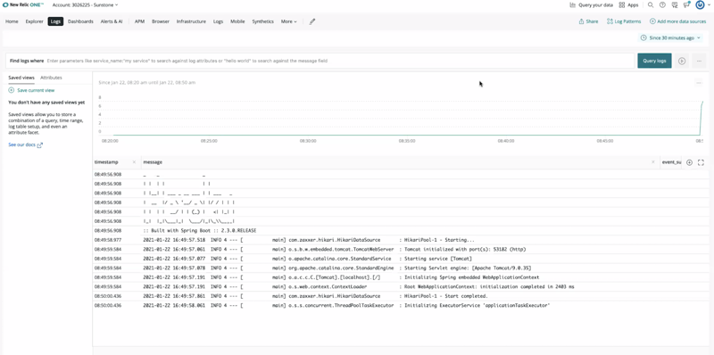

In our ongoing commitment to constantly innovate and build more integrations for the most common sources, we’re excited to announce we now provide built-in integration for Heroku.



## Get started

1. Download and install the [Heroku CLI](https://devcenter.heroku.com/articles/heroku-cli#download-and-install).

2. Create a syslog drain that will send logs to New Relic and attach it to your app: `heroku drains:add syslog+tls://newrelic.syslog.nr-data.net:6515 -a YOUR_APP_NAME`

3. Run the following to retrieve the drain token assigned to the drain created in step 2: `$ heroku drains -a YOUR_APP_NAME --json`

4. Copy the value from the "token" attribute returned by the command above:

```
  {
    "addon": null,
    "created_at": "2018-12-04T00:59:46Z",
    "id": "906262a4-e151-45d2-b35a-a2dc0ea9e688",
    "token": "d.f14da5dc-106b-468d-b1bd-bed0ed9fa1e7",
    "updated_at": "2018-12-04T00:59:47Z",
    "url": "syslog://logs.example.com"
  }
```  
5. Launch [New Relic Logs](https://one.newrelic.com/launcher/logger.log-launcher) and click **Add more data sources**.


6. Click on the Heroku tile, add your [drain token](https://devcenter.heroku.com/articles/log-drains#drain-tokens), and select an [Insights Insert API key](https://docs.newrelic.com/docs/apis/get-started/intro-apis/new-relic-api-keys/#insights-insert-key) to map it to.


7. Click **Add Heroku drain log** and logs will begin flowing to your New Relic account within seconds.