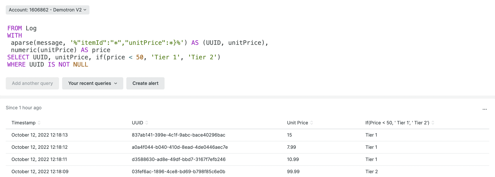
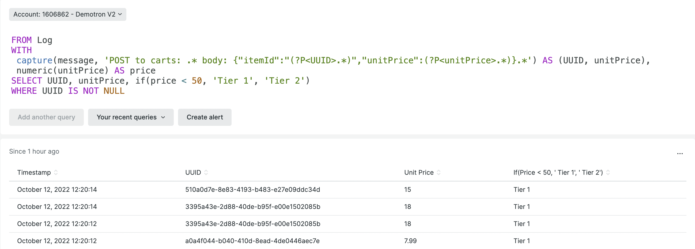

## NRQL productivity improvements makes querying faster with anchor parse, regex multi-capture, and more.

Making sense of complex data like log messages just got easier! With NRQL variables, the new `aparse()` and `if()` functions, you can obtain useful information from your data more efficiently and gain insights faster.

With NRQL variables, you can assign values to variables and use them multiple times in your query.  The `if()` function lets you select one of two results based on a condition that's either true or false. In addition, we've enhanced our existing regex `capture()` function to allow multiple capture groups, for simpler queries with better performance!

In this example, we extract an item ID, and unit price from a log message, and additionally show which pricing tier the item falls into: 

The aparse() function is a simpler, faster alternative to capture() for use when you don't require the full power of regular expressions. With aparse(), use "anchor" text and the '*' wildcard to capture the fields you need:

Check out this demo on the new NRQL queries in this [NerdByte](https://www.youtube.com/watch?v=AxDS1IJCfbY):

## Next steps

1. Review the docs for [NRQL variables](/docs/query-your-data/nrql-new-relic-query-language/get-started/nrql-syntax-clauses-functions/#with-as-nrql-var), [aparse()](/docs/query-your-data/nrql-new-relic-query-language/get-started/nrql-syntax-clauses-functions/#func-aparse) and [if()](/docs/query-your-data/nrql-new-relic-query-language/get-started/nrql-syntax-clauses-functions/#func-if) and start writing your own queries!
2. Read our [blog](https://newrelic.com/blog/how-to-relic/nrql-improvements) post for more tips and examples.
3. Share your feedback, post your own queries, and see even more examples in the Explorer's Hub discussion on [Anchor Parse and NRQL Variables](https://discuss.newrelic.com/t/anchor-parse-nrql-variables-parsing-values-from-log-just-got-easier/), [Regex Multi-capture](https://discuss.newrelic.com/t/regex-multi-capture-now-possible-in-nrql/), and (If())[https://discuss.newrelic.com/t/the-if-function-is-now-available-in-nrql/]
